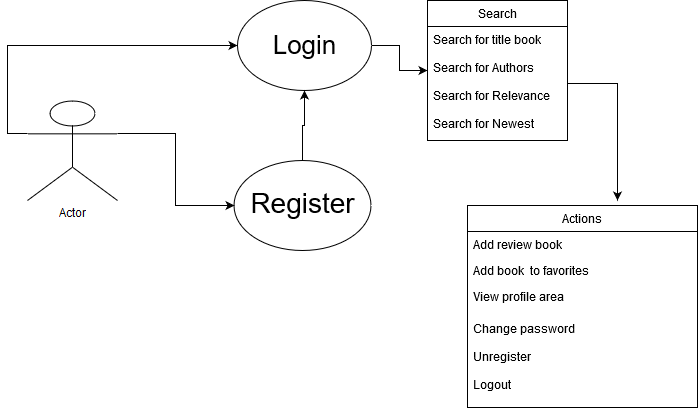
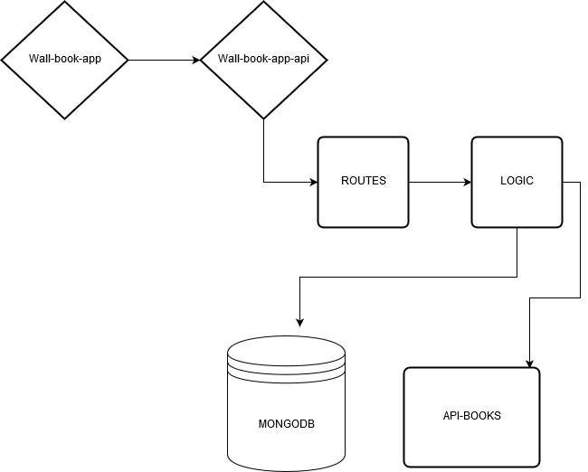

 ## WALL-BOOK

 ### Definition:

 > Wall-book is a book recommendation site.Users must create an account in order to access its content.
>Users can search for books by their titles, authors, relevance or newest.
>This site is aimed at Spanish speakers and should return the book results in Spanish.
>Once the user has an account, they can rate any book, write a review, add the book to favorites, update password and unregister user.

## User Cases

## Data Model 

## Block Model

### What did I use?
+ ReactJS
+ Reactstrap
+ ES6
+ Node
+ Express
+ Google Books API
+ MongoDB
+ Mongoose
+ Git
+ GitHub
+ Mocha
+ Sweetalert 2
+ Google-search-book-2

[Live Demo ](http://dev.nodeca.com)
